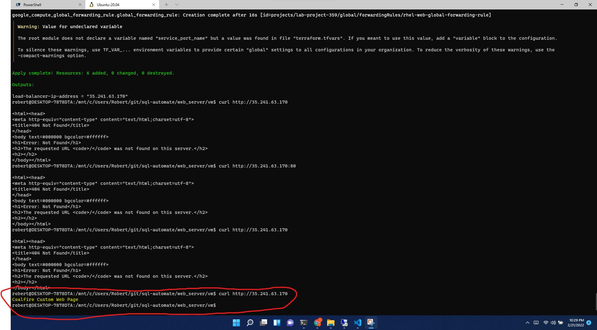

# Terraform Code         

This code was written to implement the requested challenge to create a VPC in Google Cloud Platform with 4 subnets, (two public and two private), a private web server, a load-balancer connecting the public internet to the private i

## Compatibility

This code is meant for use with Terraform 0.13+ and tested using Terraform 1.0+.
If you find incompatibilities using Terraform `>=0.13`, please open an issue.

## Usage
The code is seprated into two folders with unique state files. The ["VPC"](vpc) folder contains the code to create a VPC, Subnets, Firewall Rules, Cloud Router and Cloud NAT. 
The ["VM"](vm)folder contains the code to create the RHEL webserver, unmanaged instance group, and associated HTTP(S) Load balancer. 

